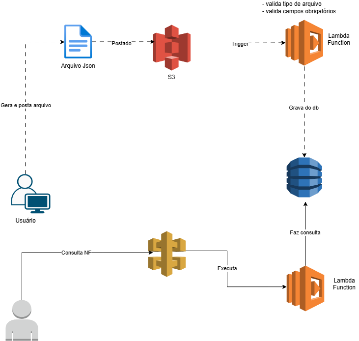

 # Desafio de Projeto AWS CloudFormation, Lambda, S3 e DynamoDB

## 📋 Descrição

Este projeto foi desenvolvido como parte do desafio prático da DIO com o objetivo de consolidar conhecimentos sobre automação de infraestrutura e processamento serverless na AWS.

A solução implementa um fluxo completo para processamento de notas fiscais em formato JSON utilizando:

- Amazon S3
- AWS Lambda
- Amazon DynamoDB
- Amazon API Gateway
- AWS CloudFormation
- LocalStack

Além da implementação técnica, o projeto documenta os aprendizados e boas práticas adquiridos durante o desenvolvimento.

---

# 🎯 Objetivos de Aprendizagem

- Aplicar conceitos de computação em nuvem na prática;
- Implementar uma arquitetura serverless;
- Automatizar tarefas utilizando eventos do S3 e Lambda;
- Persistir dados utilizando DynamoDB;
- Expor serviços através do API Gateway;
- Utilizar CloudFormation para Infraestrutura como Código (IaC);
- Documentar processos técnicos utilizando GitHub.

---

# 🏗️ Arquitetura da Solução

## Fluxo de Processamento

```text
Usuário
   │
   ▼
Upload JSON
   │
   ▼
Amazon S3
   │
   ▼
Evento ObjectCreated
   │
   ▼
Lambda ProcessarNotasFiscais
   │
   ├── Valida JSON
   ├── Valida campos obrigatórios
   ├── Grava dados no DynamoDB
   │
   ├── Sucesso
   │      ▼
   │   sucesso/
   │
   └── Erro
          ▼
       erro/
```

## Fluxo de Consulta

```text
Cliente
   │
   ▼
API Gateway
   │
   ▼
Lambda ConsultarNotasFiscais
   │
   ▼
DynamoDB
```

---

# 🖼️ Arquitetura Visual

Adicionar o diagrama criado durante o projeto:

```text
/images/arquitetura.png
```

```markdown

```

---

# ⚙️ Tecnologias Utilizadas

- Python 3.9
- AWS Lambda
- Amazon S3
- Amazon DynamoDB
- Amazon API Gateway
- AWS CloudFormation
- AWS CLI
- LocalStack
- Docker
- Postman
- GitHub

---

# 📁 Estrutura do Projeto

```text
aws-cloudformation-lambda-s3
│
├── cloudformation
│   └── stack.yaml
│
├── lambdas
│   ├── processar_notas.py
│   └── consultar_notas.py
│
├── exemplos
│   ├── notas_fiscais_2026.json
│   └── notas_com_erro.json
│
├── scripts
│   ├── criar_bucket.ps1
│   ├── criar_tabela.ps1
│   ├── criar_lambda.ps1
│   └── criar_api_gateway.ps1
│
├── images
│   ├── arquitetura.png
│   ├── upload_s3.png
│   ├── dynamodb.png
│   └── api_gateway.png
│
└── README.md
```

---

# ☁️ Infraestrutura como Código (IaC)

Foi criado um template CloudFormation para automatizar a criação dos principais recursos da solução:

- Bucket S3
- Tabela DynamoDB
- IAM Role
- Lambda Function
- Permissões necessárias

Arquivo:

```text
cloudformation/stack.yaml
```

Exemplo de recursos provisionados:

```yaml
Resources:

  BucketNotasFiscais:
    Type: AWS::S3::Bucket

  TabelaNotasFiscais:
    Type: AWS::DynamoDB::Table

  ProcessarNotasLambda:
    Type: AWS::Lambda::Function
```

---

# 📥 Exemplo de Arquivo de Entrada

```json
[
  {
    "id": "NF-1",
    "cliente": "Pedro Lima",
    "valor": 2084.34,
    "data_emissao": "2026-05-27"
  },
  {
    "id": "NF-2",
    "cliente": "Maria Oliveira",
    "valor": 899.58,
    "data_emissao": "2026-05-30"
  }
]
```

---

# 🔄 Processamento dos Arquivos

Ao realizar o upload de um arquivo JSON no bucket:

1. O S3 dispara um evento `ObjectCreated`;
2. A Lambda é acionada automaticamente;
3. O conteúdo do JSON é validado;
4. Os registros são gravados na tabela DynamoDB;
5. O arquivo é renomeado utilizando timestamp;
6. O arquivo é movido para a pasta `sucesso`.

Exemplo:

```text
sucesso/20260629153045_notas_fiscais_2026.json
```

---

# ❌ Tratamento de Erros

Caso o JSON esteja inválido ou algum campo obrigatório esteja ausente:

- O registro não é gravado;
- O arquivo é movido para a pasta `erro`.

Exemplo:

```text
erro/20260629153218_notas_com_erro.json
```

---

# 🗄️ DynamoDB

Tabela utilizada:

```text
NotasFiscais
```

Chave primária:

```text
id
```

Exemplo de registro armazenado:

```json
{
  "id": "NF-1",
  "cliente": "Pedro Lima",
  "valor": 2084.34,
  "data_emissao": "2026-05-27"
}
```

---

# 🌐 API Gateway

Foi criado um endpoint para consulta das notas fiscais armazenadas no DynamoDB.

## Consultar todas as notas

```http
GET /dev/notas
```

Exemplo:

```http
http://localhost:4566/restapis/{api-id}/dev/_user_request_/notas
```

Resposta:

```json
[
  {
    "id": "NF-1",
    "cliente": "Pedro Lima",
    "valor": 2084.34,
    "data_emissao": "2026-05-27"
  }
]
```

---

# 📸 Evidências

## Upload realizado no bucket S3

```markdown

```

---

## Registros armazenados no DynamoDB

```markdown

```

---

## Consulta realizada através do API Gateway

```markdown

```

---

# 💡 Principais Aprendizados

Durante o desenvolvimento deste projeto foi possível compreender:

- Como eventos do S3 podem disparar funções Lambda automaticamente;
- Como implementar arquiteturas serverless;
- Como utilizar DynamoDB para armazenamento NoSQL;
- Como expor funcionalidades através do API Gateway;
- Como evitar reprocessamento de arquivos em eventos do S3;
- Como organizar arquivos processados utilizando prefixos (`sucesso/` e `erro/`);
- Como utilizar LocalStack para desenvolvimento local;
- Como aplicar conceitos de Infrastructure as Code utilizando CloudFormation.

---

# 🚀 Melhorias Futuras

- Consulta por ID da nota fiscal;
- Consulta por cliente;
- Consulta por período;
- Paginação dos resultados;
- Deploy em ambiente AWS real;
- Pipeline CI/CD utilizando GitHub Actions;
- Monitoramento com CloudWatch.

---

# 👨‍💻 Autor

**Gei Batista**

Projeto desenvolvido como parte do Bootcamp AWS da DIO para estudo de:

- CloudFormation
- Lambda Functions
- Amazon S3
- Amazon DynamoDB
- API Gateway
- Arquitetura Serverless
